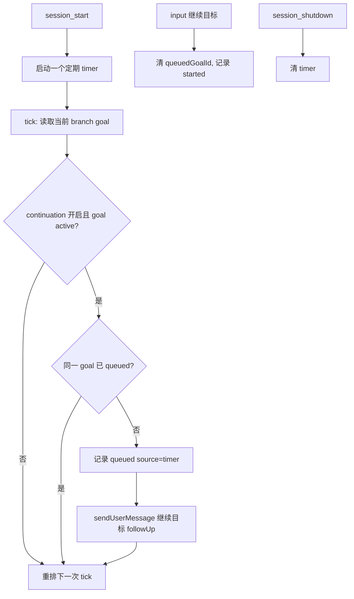

# Tech Design: Goal 定期 Follow-up

> PRD: `docs/prd-autonomous-goal-continuation.md`
> 状态: APPROVED

## 方案概述

本地 fork 对 active `/goal` 使用定期 follow-up：session 启动后，每隔配置的正分钟数尝试发送一次 `继续目标`。默认间隔为 20 分钟。

这不是静默看门狗。运行时不计算 branch 静默时间，不检查 idle 或 pending-message 状态，也不维护回合、无进展或时长预算。用户要停止自动推进时使用 `/goal pause`、`/goal complete`、`/goal clear` 或 `--goal-continuation=false`。

## 配置

```text
--goal-continuation
--goal-continuation-interval-minutes <number>
```

- `goal-continuation`：布尔值，本地 fork 默认开启；设为 `false` 时不发送自动 follow-up。
- `goal-continuation-interval-minutes`：正数分钟，默认 `20`；缺失、非数值或非正数时回退默认值。

## 状态

```ts
type GoalContinuationSource = "timer" | "explicit";

type GoalContinuationRecord = {
  action: "queued" | "started" | "stopped";
  goalId: string;
  at: number;
  turnCount: number;
  source?: GoalContinuationSource;
};

type GoalContinuationState = {
  queuedGoalId?: string;
  hydrated: boolean;
};
```

`queuedGoalId` 是去重边界：同一 goal 的上一条 follow-up 未被输入 hook 消费前，后续 tick 不再发送。输入 hook 收到 `继续目标` 后清除该字段并记录 `started`，下一周期才可再次排队。

## 生命周期



1. `session_start` 建立递归 `setTimeout`，确保同一 runtime 只有一个 timer。
2. 每个 tick 重新读取 branch 的 canonical snapshot；只有 continuation 未关闭、goal 为 active、且没有同 goal queued follow-up 时才发送。
3. follow-up 固定使用 `deliverAs: "followUp"` 和内容 `继续目标`；完整工作图、blocker 与进度由隐藏 `goal-context` 注入。
4. paused、complete、clear、replacement 或 stale goal 在 tick 的 active-state 检查中不发送。
5. `agent_settled` 只同步 SQLite 审计账本；不直接发送下一轮，因此 Esc 中断不会立即续跑。
6. `session_shutdown` 取消 timer。reload 后新的 runtime 从当前 branch 重新建立 timer；不承诺恢复已排队消息。

## 取舍

- **选择固定周期而非 watchdog**：用户需要持续推进，不需要根据静默状态推断何时继续；实现更小、行为更可预测。
- **不加入预算/blocked 自动停止**：这些策略由用户通过 pause、complete、clear 或显式关闭决定；工作项与 blocker 仍用于上下文和人工决策。
- **保留 queued 去重**：避免同一个未消费 follow-up 被多个 tick 重复投递。

## 风险与用户控制

| 风险 | 控制方式 |
| --- | --- |
| active goal 持续产生 follow-up | `/goal pause`、`/goal complete`、`/goal clear` 或 `--goal-continuation=false` |
| 需要更慢或更快节奏 | `--goal-continuation-interval-minutes <n>` |
| 前一条 follow-up 未被消费 | queued 去重，直到输入 hook 消费后才允许下一条 |
| session 关闭 | shutdown 清理 timer，不在后台继续运行 |

## 验收与测试

自动化测试必须覆盖：

1. 默认 20 分钟和自定义正 interval。
2. continuation 关闭时不排队。
3. active goal 只能保留一条 queued follow-up。
4. 消费一条 follow-up 后，下一个 interval 可以再排队。
5. paused、complete、clear 与 stale goal 不排队。
6. session shutdown 后不再触发 timer。

发布前仍需在真实 Pi TUI 手工验证 active goal、pause/resume、reload、resume、tree/fork、compaction 与 widget。