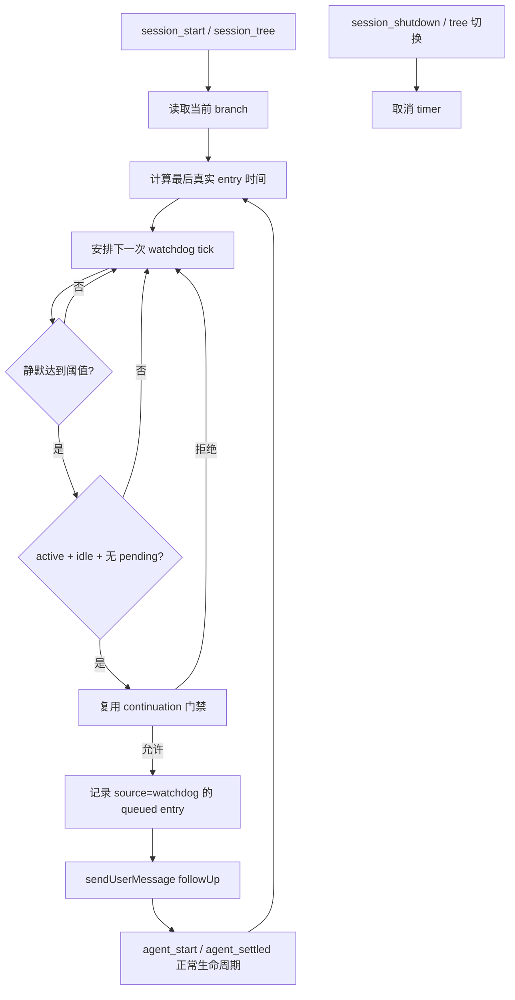

# Tech Design: Goal 静默看门狗

> PRD: `docs/prd-autonomous-goal-continuation.md`
> 状态: APPROVED

## 方案概述

使用 session 级静默看门狗作为唯一自动续跑入口。`agent_settled` 只结算运行状态并重排定时器，不直接发送消息。看门狗只观察当前 branch 的真实 entry；active goal 连续 30 分钟没有新 entry，且 parent agent 空闲、没有待处理消息、没有已排队/运行的 continuation，并通过现有预算与 blocker 门禁时，发送一条内容为 `继续目标` 的 `followUp`。

看门狗不监听或解析 `EagleEye task settled` 文案。该文案来自 `ctx.ui.notify()`，不写 session branch，因此不会刷新活动时间。

## 架构设计



## 模块划分

| 模块         | 职责                                           | 文件路径                                               |
| ------------ | ---------------------------------------------- | ------------------------------------------------------ |
| Runtime      | 看门狗状态、活动检测、timer 生命周期、触发调度 | `src/runtime.ts`                                       |
| 类型         | continuation 记录增加触发来源                  | `src/runtime.ts`                                       |
| 单元测试     | fake timer、静默阈值、去重、门禁和 UI 通知隔离 | `tests/continuation.test.ts`                           |
| 生命周期测试 | reload、tree、shutdown、subagent notify 后恢复 | `tests/integration/session-lifecycle.test.ts`          |
| 文档         | 参数、行为、排障和兼容性                       | `README.md`、`docs/setup.md`、`docs/implementation.md` |

## 接口定义

### 新增启动参数

```text
--goal-continuation-watchdog
--goal-continuation-watchdog-silence-minutes <number>
```

- `goal-continuation-watchdog`：布尔值；本地 fork 默认开启。显式关闭 continuation 时，看门狗同时失效。
- `goal-continuation-watchdog-silence-minutes`：默认 `30`，必须为正数；非法值回退默认值。
- 测试通过注入 `now` 和 timer adapter 控制时间，不依赖真实等待。

### continuation 记录

```ts
type GoalContinuationSource = "settled" | "watchdog" | "explicit";

interface GoalContinuationRecord {
	action: "queued" | "started" | "stopped" | "completed-turn";
	source?: GoalContinuationSource;
	// 其余字段保持不变
}
```

旧记录没有 `source` 时按 `settled` 兼容读取。看门狗触发的 `queued` 记录在发送消息前持久化，因此 reload 后可以识别该静默窗口已经唤醒过。

### branch 活动快照

```ts
interface GoalBranchActivity {
	entryId?: string;
	occurredAt: number;
	branchLength: number;
}
```

活动计算规则：

1. 读取 `ctx.sessionManager.getBranch()` 的最后一个真实 entry。
2. 优先使用 entry 的宿主时间戳；无法解析时，以首次观察该 entry 的本地时间作为 `occurredAt`。
3. 通过 entry id；没有 id 时使用 branch 长度与末项引用特征，判断是否出现新活动。
4. timer tick、`setStatus`、`setWidget`、`ui.notify` 和终端响铃不属于 branch entry，不刷新活动时间。
5. 看门狗写入的 `queued` continuation entry 属于真实活动，并立即结束当前静默窗口。

## Runtime 状态

```ts
interface GoalWatchdogState {
	timer?: ReturnType<typeof setTimeout>;
	generation: number;
	goalId?: string;
	lastActivity?: GoalBranchActivity;
	lastWatchdogQueuedAt?: number;
	disposed: boolean;
}
```

- `generation` 防止 tree 切换或 reload 前创建的异步 tick 操作新 branch。
- 每次只允许一个 timer；采用递归 `setTimeout`，不使用不可控的永久 `setInterval`。
- 下一次检查间隔为“距静默阈值的剩余时间”，但最长 60 秒复查一次，便于 busy/pending 状态恢复后及时重试。
- `session_shutdown` 必须 clear timer 并使 generation 失效。

## 调度流程

### 正常路径

1. `session_start` 恢复 continuation ledger，建立 branch 活动快照并启动 timer。
2. `agent_settled` 只调用 continuation 结算逻辑，不调用排队逻辑；随后与 `agent_start`、`input` 和 `session_tree` 一样重新观察 branch。只有 branch entry 真实变化才刷新活动时间。
3. 达到 30 分钟静默后调用 watchdog evaluator。
4. evaluator 先检查 watchdog/continuation 开关、goalId、idle、pending message、queued/running 状态和静默窗口去重。
5. 通过后调用现有 `maybeQueueGoalContinuation`，传入 `source: "watchdog"`；由同一函数执行 ready work、blocker、duration、turn 和 no-progress 门禁。
6. `queued` entry 成功写入后发送 `继续目标` follow-up；后续由 `agent_start` 和 `agent_settled` 记账。

### busy 或 pending message

- 不发送消息，也不记录 watchdog 已触发。
- 60 秒后重新检查。
- pending completion 通知写入 branch 后会刷新静默起点；只有该通知之后再静默 30 分钟才唤醒，避免与正在投递的消息竞争。

### reload 与 branch 切换

- 先取消旧 timer 并递增 generation。
- 从新 branch 最后 entry 的时间重新计算。
- 若最后 entry 是 `source=watchdog` 的 queued record，恢复其窗口去重状态；不得立即重复发送。
- 当前实现的 continuation hydration 同步恢复未消费的 queued 状态，避免 reload 后丢失已排队消息。

## 关键取舍

### 为什么不把 `agent_settled` 当作活动

`agent_settled` 是生命周期信号，不一定生成 branch entry。`bell-notify.ts` 对它调用 `ctx.ui.notify("EagleEye task settled")`，只是 UI 副作用。若把它算活动，通知扩展或重复 settle 可能永久推迟看门狗。

### 为什么不是每小时无条件发送

无条件定时消息会与用户输入、后台 completion、正在运行的 agent 或已停止的 goal 竞争。静默阈值只是候选条件，所有现有调度门禁仍必须通过。

### 为什么复用 `maybeQueueGoalContinuation`

避免形成第二套 ready work、blocker 和预算判断。看门狗只负责补充调度机会，不改变目标是否允许继续的判断。

## 风险与应对

| 风险                         | 概率 | 影响                          | 应对                                                                          |
| ---------------------------- | ---- | ----------------------------- | ----------------------------------------------------------------------------- |
| 宿主 branch entry 没有时间戳 | 中   | reload 后无法精确还原静默时长 | 首次观察时间失败关闭；重新等待完整阈值，不提前唤醒                            |
| timer 与新用户消息竞争       | 中   | 注入多余 follow-up            | 检查前后重读 branch、goalId 和 pending 状态；输入事件使 generation 失效后重排 |
| reload 丢失 queued 状态      | 中   | 重复唤醒                      | hydration 恢复 queued record，并以 watchdog source 去重                       |
| goal 已全部阻塞              | 低   | 无效循环                      | 复用 `all_paths_blocked` 和 stop reason 门禁                                  |
| timer 阻止进程退出           | 低   | Pi 无法正常关闭               | shutdown clear timer；Node timer 调用 `unref()`（存在时）                     |
| 测试需要等待一小时           | 低   | 测试缓慢或不稳定              | Vitest fake timers 与注入时钟                                                 |

## 实现步骤

| 步骤 | 描述                                               | 产出                           |
| ---- | -------------------------------------------------- | ------------------------------ |
| 1    | 扩展 continuation record/source 与 hydration       | 可持久化触发来源和 queued 状态 |
| 2    | 实现 branch 活动观察及 watchdog evaluator          | 纯函数、可注入时间             |
| 3    | 接入 session/input/agent 生命周期和 timer 清理     | 运行时兜底唤醒                 |
| 4    | 增加 fake timer 和 lifecycle 回归测试              | 自动验证阈值、去重和安全门禁   |
| 5    | 更新版本、CHANGELOG、README、setup、implementation | 发布说明与使用说明             |
| 6    | 运行完整校验及手工 Pi smoke                        | 验证报告                       |

## 验收标准与验证

| PRD 验收项                | 技术验证                                                                  |
| ------------------------- | ------------------------------------------------------------------------- |
| Esc/settled 不立即唤醒    | 调用 `agent_settled` 后断言不发送 follow-up                               |
| 静默 30 分钟后唤醒        | fake timer 推进到阈值，断言只发送一次 `继续目标` follow-up                |
| subagent pointer 后可恢复 | branch 加入 `subagent-notify`，推进 30 分钟后断言 parent follow-up        |
| UI settled 不影响计时     | 仅调用 `agent_settled`/UI notify、不新增 branch entry，断言活动时间不变   |
| busy/pending 不唤醒       | 模拟 busy/pending，断言不发送；状态解除后下一 tick 重试                   |
| 安全停止不绕过            | 覆盖 paused、complete、clear、stale、blocked、duration、turn、no-progress |
| reload/tree 不重复        | 恢复 watchdog queued record并切换 branch，断言旧 timer 失效且无重复消息   |
| timer 正确释放            | session shutdown 后推进 fake timer，断言无回调副作用                      |

发布前运行：

```text
npm run typecheck
npm run lint
npm run format
npm test
npm run smoke:pi
npm run smoke:package
```
