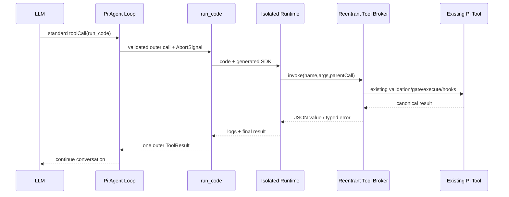

# Synthesis Round 1 — DeepSeek Code Mode / PTC × Pi

## 一句话结论

**可以加入 Pi，但完整实现应落在 Pi 核心或一个很小的核心工具代理接口上；纯扩展只能实现受限版本或 provider“蹦床”仿真，无法透明覆盖任意动态工具。** 置信度：high。

## 1. 术语与四个内置模式

DeepSeek Harness 官方确实提供四个内置 **Agent preset（预设配置）**：

1. 标准模式（Standard mode）
2. **PTC 模式**（英文界面名为 Code mode）
3. 极简模式（Minimal mode）
4. 创造模式（Creator mode）

因此“PTC 是官方模式名”成立，但要区分两个层级：

- **产品层**：中文界面和 `code/preset.yml` 把该 Agent preset 命名为“PTC 模式”；
- **工具呈现层**：该 preset 只比标准模式多配置 `@deepseek-ai/dsh-agent-tool-presentation`，并设置 `mode: code`；工具注册表底层支持 `native | code | both` 三种呈现方式。

PTC/Code mode 仍不是 DeepSeek API 新增的特殊响应协议：模型通过标准 function calling 发出 `run_code`，Harness 负责生成工具 SDK、执行模型代码，并把程序内的 SDK 调用重新送入完整工具管线。DeepSeek API 官方也明确：模型本身不执行函数，执行责任在调用方。

证据：
- https://github.com/deepseek-ai/deepseek-harness/blob/master/apps/cli/config/agent-presets/code/preset.yml
- https://github.com/deepseek-ai/deepseek-harness/blob/master/apps/cli/config/agent-presets/code/agent.cordis.yml
- https://github.com/deepseek-ai/deepseek-harness/blob/master/packages/client/ui-agent-preset/src/client/locales.ts
- https://github.com/deepseek-ai/deepseek-harness/blob/master/packages/core/tools/README.md
- https://api-docs.deepseek.com/guides/tool_calls/

置信度：high。

## 2. PTC 真正要求 Harness 提供什么

完整 Code Mode 至少包含：

1. 对模型只暴露 `run_code` 和按当前工具集生成的类型化 SDK；
2. 每次代码运行使用独立运行环境；
3. 程序内 `tools.name(args)` 能调用当前可见工具；
4. 子调用重新经过参数校验、授权门禁、执行、结果后处理和取消链；
5. 中间结果只留在运行时，只有程序日志与最终返回进入模型上下文；
6. outer call / sub-call 关联、并发限制、错误映射和审计；
7. 副作用不回滚，取消与崩溃不能默认重放。

DeepSeek 的 worker-thread 后端每次创建 fresh worker，并有计算、墙钟、堆和输出上限，但官方明确称其为 containment，不是安全边界。

证据：
- https://github.com/deepseek-ai/deepseek-harness/blob/master/packages/core/tools/README.md
- https://github.com/deepseek-ai/deepseek-harness/blob/master/packages/code-runtime/code-runtime-worker-thread/README.md

置信度：high。

## 3. Pi 当前能力与关键缺口

当前核对基线为 `@earendil-works/pi-coding-agent` / `pi-agent-core` **0.84.1**。

Pi 的 Agent loop 已经集中处理标准工具调用：解析 assistant `toolCall`、准备和校验参数、执行 `beforeToolCall`、调用工具、执行 `afterToolCall`、发出事件并构造 `toolResult`。这意味着核心实现 PTC 可以复用现有管线，而不应另写一套旁路执行器。

但是，Pi 的扩展 API 只公开：

- `registerTool()`：注册自己的工具；
- `tool_call` / `tool_result`：拦截、阻断或修改调用结果；
- `getAllTools()`：读取工具元数据；
- `registerProvider()` / `streamSimple`：实现自定义 provider 流。

它没有公开一个“按当前会话语义执行任意活动工具”的 `invokeTool/executeTool`。因此，扩展内部的 `run_code` 工具无法透明调用内置工具和其他第三方扩展工具，同时继承 Pi 的全部校验、门禁、取消和事件语义。

证据：
- `/mnt/workspace/lilong/envs/tsien/conda/envs/nodejs/lib/node_modules/@earendil-works/pi-coding-agent/node_modules/@earendil-works/pi-agent-core/dist/agent-loop.js:78-145,287-540`
- `/mnt/workspace/lilong/envs/tsien/conda/envs/nodejs/lib/node_modules/@earendil-works/pi-coding-agent/dist/core/extensions/types.d.ts:866-1026`
- `/mnt/workspace/lilong/envs/tsien/conda/envs/nodejs/lib/node_modules/@earendil-works/pi-coding-agent/docs/extensions.md:751-845,1646-1668,1705-1831`

置信度：high。

## 4. 路线一：Pi 核心原生支持

### 架构

### 需要的核心改动

- 抽取现有 `prepare → execute → finalize` 为可重入 Tool Broker；
- 增加 parent/child 调用身份和嵌套事件；
- 增加 `run_code` transport 与 SDK 生成器；
- 定义 CodeRuntime 接口，首个实现应运行在容器或微虚拟机，不把 Node worker 当安全边界；
- outer AbortSignal 必须传播到运行时和全部子调用，并在返回前 drain；
- 会话持久化只保存 outer result 与必要的审计事件，不依赖中间 canonical value 做恢复；
- 普通工具调用作为 fallback，不支持 Code Mode 的模型保持原行为。

### 判决

- 能力完整度：高
- 与现有工具策略一致性：高
- 实现成本：中高
- 长期维护性：高
- 安全风险：取决于外部隔离，默认高风险

## 5. 路线二：纯 Pi 扩展

### 可做的两种受限实现

**A. 固定工具白名单。** 扩展注册 `run_code`，只向程序暴露扩展自己实现或显式包装的少量只读工具。它简单，但不能覆盖任意动态 Pi 工具；若直接重写文件/命令逻辑，还可能绕开其他扩展的门禁。

**B. 自定义 provider 蹦床。** provider 拦截模型的 `run_code`，当程序需要子工具时，向 Pi 合成标准 assistant tool call；Pi 执行后，下一轮 provider 不请求模型，而是用 tool result 恢复程序。它理论上可复用动态工具，但会产生多个合成回合，并需要自行解决挂起 runtime、session switch、reload、fork、compact、崩溃和取消。

### 判决

- Full PTC：不可行，置信度 high
- 固定只读白名单 MVP：可行，置信度 high
- provider 蹦床仿真：技术上可能，置信度 medium；复杂度高，不适合作为长期架构
- UI 与提示词实验：可行，置信度 high

## 6. 对比矩阵

| 维度 | 核心原生 | 纯扩展固定白名单 | provider 蹦床 |
|---|---:|---:|---:|
| 任意动态工具 | 完整 | 不支持 | 可仿真 |
| 复用校验/门禁 | 完整 | 仅自身工具 | 复用顶层调用 |
| 单一 outer `run_code` | 支持 | 支持 | 不真实支持 |
| 取消与 drain | 可统一设计 | 局部可做 | 跨回合复杂 |
| 会话恢复 | 可定义正式合同 | 简单但能力弱 | 高风险 |
| 安全隔离 | 可强制后端 | 扩展自行负责 | 扩展自行负责 |
| 上游维护成本 | 中高 | 低 | 高且脆弱 |
| 适合长期产品化 | 是 | 仅受限模式 | 否 |

## 7. 推荐路线

采用两阶段策略：

1. **先做扩展 MVP，但明确叫 `Code Mode experimental` / emulation。** 只开放 3–5 个无副作用、只读工具；runtime 放在真实容器或微虚拟机；目标仅是验证模型是否会正确写程序及是否减少模型往返。
2. **验证通过后补一个最小核心 seam。** 最关键接口不是 provider 协议，而是可重入 Tool Broker，例如内部 `invokeTool({name,args,parent,signal})`。随后 `run_code`、SDK 和 runtime 可以先放扩展，核心只负责安全、统一的动态工具执行。
3. **若产品目标从一开始就是任意工具、完整审计和可靠恢复，直接做 core-native。** 不建议把 provider 蹦床升级为长期方案。

推荐置信度：high。

## 8. 验证计划

不做正式 benchmark 时，原型验收至少覆盖：

- 正确性：顺序调用、数据依赖分支、循环、并行只读调用、工具失败 catch；
- 安全性：越权工具、无限循环、超时、内存膨胀、超大输出、网络与凭证隔离；
- 取消：outer abort 后 runtime 和子调用均终止且不残留；
- 副作用：写工具不自动重放，失败明确报告已发生的调用；
- 会话：reload/fork/compact 时挂起运行明确失败或安全清理；
- DeepSeek thinking：工具调用链持续回传 `reasoning_content`，否则 API 会 400；
- 对照指标：任务成功率、模型请求次数、输入/输出 token、p95 时延、runtime 启动成本、错误恢复率。

证据：
- https://api-docs.deepseek.com/guides/thinking_mode/
- `/mnt/workspace/lilong/envs/tsien/conda/envs/nodejs/lib/node_modules/@earendil-works/pi-coding-agent/docs/security.md:31-50`

## 9. 尚未证明

- DeepSeek 模型在 Pi 的真实任务上是否比普通 tool calling 更稳定；
- SDK prompt 是否实际节省 token；官方只描述 trade-off，没有普遍收益承诺；
- provider 蹦床在所有 Pi provider、session 与 compaction 路径上的一致性；
- 最佳隔离后端及启动开销。

这些结论置信度：low，需要原型或 benchmark。
